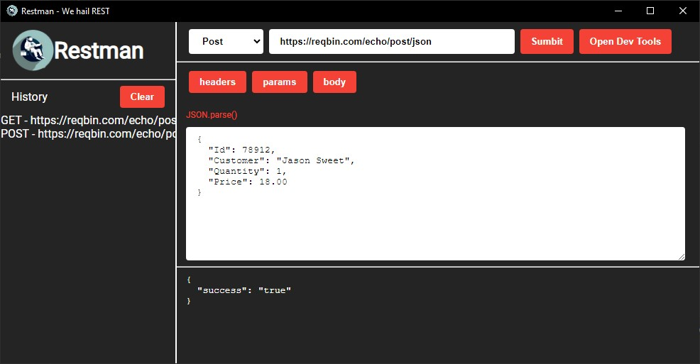
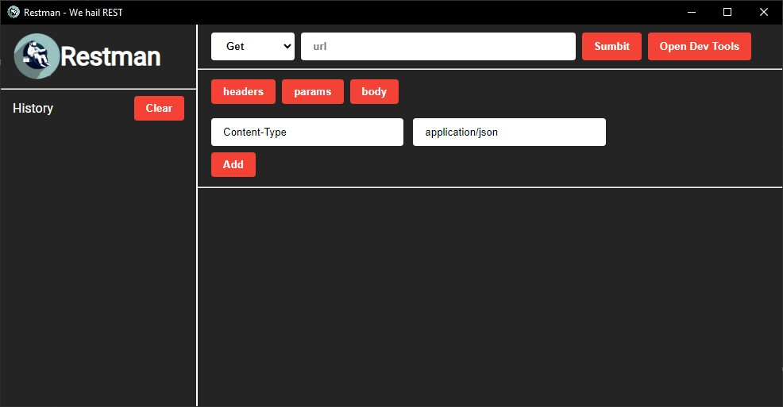

# <div style="display:flex;align-items:center"> <span>&nbsp;</span> RESTMAN</div>
<p style="font-size:12px">We Hail REST - Simple electron application to send GET and POST requests with headers, parameters and JSON body.</p>





### Installation and Usage:

To build run
```
npm install
```
```
npm run build
```

OR

```
npm run start
```

OR

Donwload files from release

---